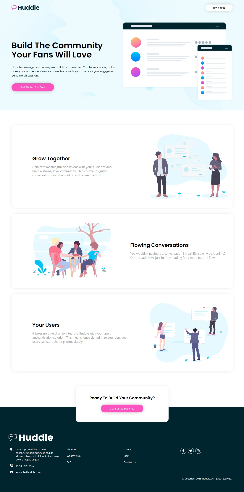

# Frontend Mentor - Huddle landing page with alternating feature blocks solution

  

This is a solution to the [Huddle landing page with alternating feature blocks challenge on Frontend Mentor](). Frontend Mentor challenges help us to improve our coding skills by building realistic projects.   

## Built with

- Semantic HTML5 markup
- CSS custom properties
- Flexbox
- CSS Grid
- Mobile-first workflow

Preview it here - [Huddle landing page with alternating feature blocks](https://blackfury117.github.io/Clipboard-landing-page/)   

## Author

- Website - [Black Fury](https://blackfury117.github.io/)
- Frontend Mentor - [@BlackFury117](https://www.frontendmentor.io/profile/BlackFury117)
- Twitter - [@blackfury117](https://www.twitter.com/blackfury117)